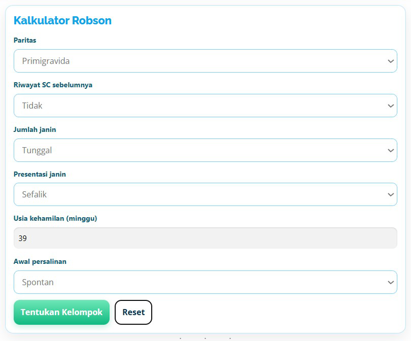

# robson-calculator
Robson Classification Calculator (HTML/JS widget) Bahasa Indonesia

## 📸 Screenshot


# Robson Classification Calculator (Web App)

A simple web app to determine obstetric cases into the **Robson Ten-Group Classification System (RTGCS)**, following the WHO standard.  
This project was related to the article *“Cara Mudah Klasifikasi Robson Versi WHO”* on [Benang Merah](https://benangmerah.net/?p=284).

---

## 🌐 Live Demo
👉 [GitHub Pages Demo](https://yosephsamodra.github.io/robson-calculator/)

---

## 🔍 About

The calculator guides clinicians and students to classify pregnancies into one of the 10 Robson groups, based on:

- **Paritas** (Primigravida / Multipara)  
- **Riwayat SC sebelumnya** (Ya / Tidak)  
- **Jumlah janin** (Tunggal / Ganda)  
- **Presentasi janin** (Kepala / Sungsang / Lintang)  
- **Usia kehamilan** (dalam minggu)  
- **Awal persalinan** (Spontan / Induksi / SC elektif sebelum inpartu)  

This helps audit and compare cesarean section rates in a standardized way.

---

## 🧮 Decision Tree (Ringkas)

1. **Jumlah janin**  
   - Ganda → **Grup 8**  
   - Tunggal → lanjut  

2. **Presentasi**  
   - Lintang / oblique → **Grup 9**  
   - Sungsang → Nullipara → **Grup 6**; Multipara → **Grup 7**  
   - Kepala → lanjut  

3. **Usia kehamilan**  
   - < 37 minggu → **Grup 10**  
   - ≥ 37 minggu → lanjut  

4. **Riwayat SC**  
   - Ya → **Grup 5**  
   - Tidak → lanjut  

5. **Paritas & Awal persalinan**  
   - Nullipara (primigravida): Spontan → **Grup 1**, Induksi/SC elektif → **Grup 2**  
   - Multipara tanpa SC: Spontan → **Grup 3**, Induksi/SC elektif → **Grup 4**

---

## 📋 Group Descriptions

| Group | Deskripsi                                                                 |
|-------|---------------------------------------------------------------------------|
| 1     | Nullipara, tunggal, kepala, cukup bulan, persalinan spontan               |
| 2     | Nullipara, tunggal, kepala, cukup bulan, induksi atau SC elektif          |
| 3     | Multipara tanpa SC, tunggal, kepala, cukup bulan, persalinan spontan      |
| 4     | Multipara tanpa SC, tunggal, kepala, cukup bulan, induksi atau SC elektif |
| 5     | Multipara dengan SC, tunggal, kepala, cukup bulan                         |
| 6     | Nullipara, sungsang                                                       |
| 7     | Multipara, sungsang                                                       |
| 8     | Kehamilan ganda (kembar, triplet, dst)                                    |
| 9     | Presentasi lintang / oblique                                              |
| 10    | Tunggal, kepala, prematur (<37 minggu)                                    |

---

## 🚀 Usage

- Go to (https://benangmerah.net/?p=284)  
- Select characteristics in the form  
- Click **Hitung Kelompok**  
- The tool displays the Robson group and a short description  

To run locally:
```bash
git clone https://github.com/yosephsamodra/robson-calculator.git
cd robson-calculator
open index.html
